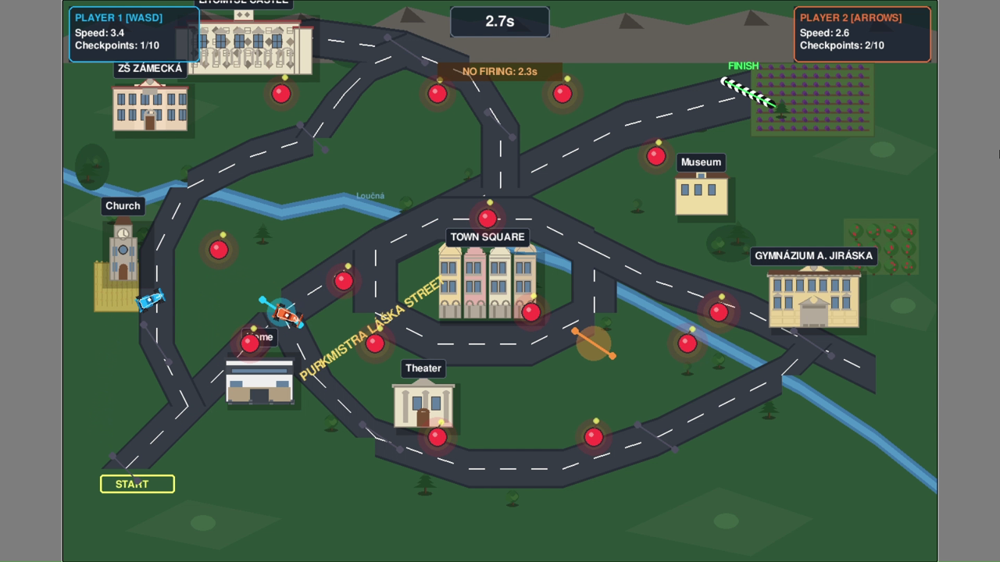

# 🏎️ Litomyšl Street Racing

[](LICENSE)
[](https://tjhavranek.github.io/race/)
[](https://github.com/pygame-web/pygbag)
[](https://docs.anthropic.com/en/docs/claude-code)

A two-player browser racing game set in Litomyšl, Czech Republic. Built by three kids (ages 8–12) using [Claude Code](https://docs.anthropic.com/en/docs/claude-code) in about two hours — and then many more hours testing and improving it.

## ▶ [Play now in your browser](https://tjhavranek.github.io/race/)

No install needed. Works on desktop and on mobile (tap the fullscreen button when prompted).



## The story

Our kids were sick and bored at home, so we introduced them to Claude Code. They did almost everything themselves — designing the track, setting the rules, picking the features. We only helped with publishing it on GitHub.

The graphics are charmingly 1980s. But it runs smoothly and it's fun.

## Controls

### Desktop (two players, one keyboard)

| Action        | Player 1 (blue)   | Player 2 (orange)    |
|---------------|-------------------|----------------------|
| Accelerate    | `W`               | `↑`                  |
| Brake/Reverse | `S`               | `↓`                  |
| Steer left    | `A`               | `←`                  |
| Steer right   | `D`               | `→`                  |
| Fire          | `E` (after 5 s)   | `Enter` (after 5 s)  |
| Start/Restart | `Space`           | `Space`              |
| Menu/Exit     | `Esc`             | `Esc`                |

### Mobile (one human + bot)

On touch devices, Player 2 becomes a bot. Touch the screen to steer, double-tap to fire.

## How to play

1. Race from **START** to **FINISH**.
2. Pass through all the checkpoints — they are colored to show whose they are.
3. Avoid the red bombs. They will destroy your car.
4. After 5 seconds you can fire — to blow up bombs, or the other player.
5. First across the finish line wins.

## Features

- Racing through the streets of Litomyšl, past real landmarks (Litomyšl Castle, Smetanovo náměstí, Gymnázium A. Jiráska, the river Loučná).
- Formula-1-style cars with checkpoints, projectiles, and destructible bombs.
- Local two-player on desktop; one human vs. bot on mobile.
- Best-time tracking (min / avg / max).
- Music toggle, fullscreen mode, mobile-friendly landscape display.

## What's in this repo

| File | What it is |
|---|---|
| `index.html` | The Pygbag-generated runtime that loads the game in the browser. Hand-customized for mobile fullscreen. |
| `favicon.png` | Tab icon. |
| `litomysl-racing-game.apk` | The game itself. Despite the extension, it is a ZIP — Pygbag's bundling convention. Inside: `racing_game.py` (the game), `main.py`, sprite assets, and the build scripts. |
| `docs/screenshot.png` | The screenshot above. |
| `.github/workflows/verify.yml` | CI guardrail — verifies the loader and icon haven't been accidentally modified, and (on manual dispatch) verifies the current APK fingerprint. |

To peek inside the bundle:

```bash
unzip litomysl-racing-game.apk -d unpacked
ls unpacked/assets/
```

## Building from source

The Python source lives inside `litomysl-racing-game.apk`. To rebuild the web bundle yourself after editing, see [CONTRIBUTING.md](CONTRIBUTING.md).

A native desktop build is also possible with PyInstaller — see the `build_windows.bat` script inside the bundle.

## About Litomyšl

[Litomyšl](https://en.wikipedia.org/wiki/Litomy%C5%A1l) is a small town in eastern Bohemia, in the Czech Republic. Its castle is a UNESCO World Heritage Site, the composer Bedřich Smetana was born there, and the central square (Smetanovo náměstí) is one of the prettiest in the country.

## Takeaway

If our kids can build a working game in two hours, you might be surprised what you can do.

## License

[MIT](LICENSE) — built by Tomáš Havránek and contributors. Have fun.
